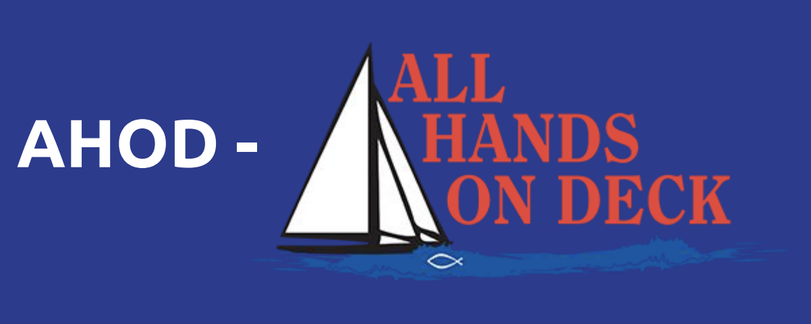
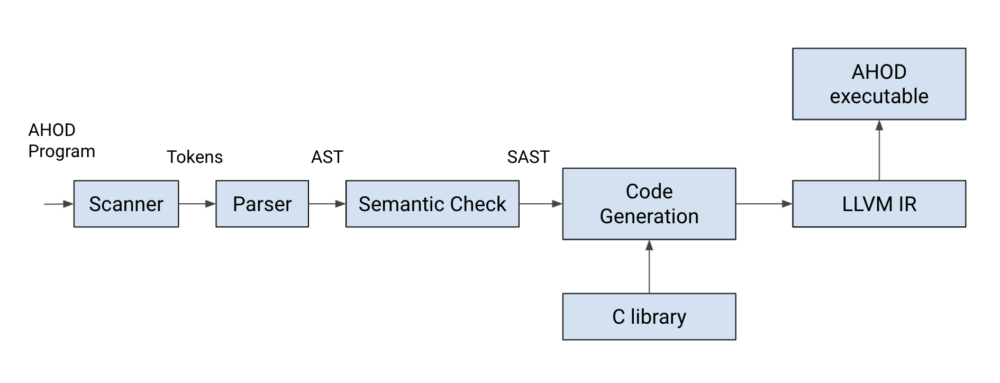

# ⚓️ AHOD - AllHandsOnDeck



The **AHOD** programming language: a user-friendly, object-oriented language that makes it easier for users to create turn-based card games, with an emphasis on code readability and modularity. 

# Table of Contents
* [Installation](#installation)
* [Tutorial](#tutorial)
* [Examples](#examples)
* [Exceptions](#exceptions)
* [Architecture](#architecture)
* [Documentation](#documentation)
* [Acknowledgements](#acknowledgements)

# Installation

AHOD requires OCaml and LLVM libraries to build and execute. Run the following commands to install
the necessary packages.

Mac OS Distributions:

```bash
> brew install opam
> brew install llvm
> opam install llvm
```

Ubuntu:

```bash
> sudo apt-get install opam
> sudo apt-get install llvm
> opam install llvm
```

Other Linux distributions:

```bash
> brew install llvm
> opam depext conf-llvm.6.0.0
> opam install llvm
> export PATH=/usr/local/opt/llvm@6/bin:$PATH
```

To buld AHOD, first clone this AHOD repository:

```bash
>  git clone https://github.com/AllHandsOnDeck-PLT/AHOD.git
```

Next, run make inside the AHOD directory to create the AHOD compiler.

```bash
>  make
>  opam config exec -- \
>  ocamlbuild -use-ocamlfind AHOD.native
```

# Tutorial
Once the compiler is created, we can begin writing our own AHOD programs. Refer to chapter 3 of the [**Final Report**](http://www.cs.columbia.edu/~sedwards/classes/2021/4115-spring/reports/AHOD.pdf) for the Language Reference Manual to learn more about writing programs in AHOD.

Below is a simple hello_world program in AHOD:

```C
main:
{
    do PRINT("Hello world!")
    do PRINT(":)")
}
/* prints hello world */
```

Save this as a hello_world.ah file. Then, compile and execute the code with the following commands:
```bash
>  ./AHOD.native helloworld.ah > helloworld.ll
>  llc -relocation-model=pic helloworld.ll > helloworld.s
>  cc -o helloworld.exe helloworld.s playercall.o
>  ./helloworld.exe
Hello world!
:)
```

# Examples

Syntactically, AHOD is most similar to C and Python. Features that are currently supported include:

| Feature       | Associated Methods  |
| ------------- |:-------------:|
| Control Flow     | if, else, while, for |
| Built-in Objects      | Player, Card      |  
| Series Literals | push, pop, get, size     |   
| Action Declarations | accessing params, return      |   

This code snippet is a simple gcd program in AHOD:

```C
int x
int y
main:
{
    x = 18
    y = 12
    while x!=y:
    {
    if x>y:
    {
        x = x - y
    }
    else:
    {
        y = y - x
    }
    }
    do PRINT(x)
}
```

This code snippet showcases some of the built-in objects and data structures in AHOD:

```C
int i
series<Card> deck
when do series<Card> CREATEDECK(series<Card> deck):
{ 
    series<string> types 
    string type 
    Card card
    types = ["R0", "R1", "R2", "R3", "R4"]
    for (i = 0; i < types.size(); i = i + 1):
    {
        type = types[i]
        card = Card(type, true, 5)   
        deck.push(card) 
    }
    return deck
} 
main:
{
    Card card
    deck = [Card("D0", true, 5)]
    deck = do CREATEDECK(deck)
    for (i = 0 ; i < 5; i = i + 1):
    {
        card = deck[i]
        do PRINT(card.type)
        do PRINT(card.faceup)
    }
}
```

# Exceptions

Runtime exceptions occur on types that are not inferrable. AHOD checks for type errors, undefined variables, and out of bounds list access. For these exceptions, we simply throw a "Fatal error: exception
Failure(...)".

For example, the following program throws 
```C
Fatal error: exception Failure("expecting 1 arguments in do ALLSTAR(Somebody, Once, Told, Me)")
```

```C
when do string ALLSTAR(string x):
{
    return "the world said hi" 
}
main:
{
    do ALLSTAR("Somebody","Once","Told","Me") 
}
```

# Architecture



# Documentation
⚓️  [**Final Report**](http://www.cs.columbia.edu/~sedwards/classes/2021/4115-spring/reports/AHOD.pdf) \
⛵️ [**Language Reference Manual**](http://www.cs.columbia.edu/~sedwards/classes/2021/4115-spring/lrms/AHOD.pdf) \
🗺 [**Proposal**](http://www.cs.columbia.edu/~sedwards/classes/2021/4115-spring/proposals/AHOD.pdf)

# Acknowledgments

This language was developed as a Programming Languages & Translators project in Spring 2021 at Columbia University by Caitlyn Chen, Tiffeny Chen, Jang Hun Choi, Mara Dimofte, and Christi Kim.
